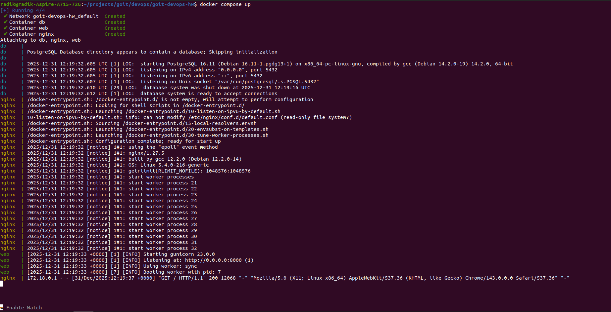
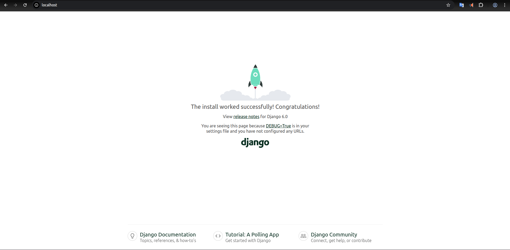

## Run the project with Docker

### Steps

1. Clone the repository and go to the project folder:

```bash
git clone <your-repository-url>
cd docker-django
```

2. Build and start all services:

```bash
docker-compose up -d --build
```

3. Open the application in your browser:

```
http://localhost
```

If everything is running correctly, you will see the Django welcome page. ✅

### Screenshots


